# Business Requirements Reference Cards - Complete Study Guide

## 📋 Card 1: Requirement Gathering Fundamentals

### 📖 Detailed Explanation
Requirement gathering is the systematic process of collecting, analyzing, and documenting what a business needs from a software or data solution. It involves understanding three key dimensions: functional requirements (what the system should do), non-functional requirements (how well the system should perform), and the distinction between business needs (strategic outcomes) and technical needs (implementation details).

**Key Components:**
- **Functional Requirements**: Specific behaviors, features, and capabilities the system must have
- **Non-Functional Requirements**: Quality attributes like performance, security, usability, and reliability
- **Stakeholder Mapping**: Identifying all people who influence or are influenced by the system
- **Business vs Technical Needs**: Separating strategic outcomes from implementation methods

### 🏢 Real-World Example
A retail bank wants to improve their mobile banking app:

**Business Need**: Increase customer satisfaction and reduce branch visits by 30%
**Functional Requirements**: 
- Transfer money between accounts
- Pay bills online
- View transaction history
- Deposit checks via photo

**Non-Functional Requirements**:
- Load time under 3 seconds
- 99.9% uptime
- Bank-grade security encryption
- Support for users with disabilities

### 📊 Visual Representation

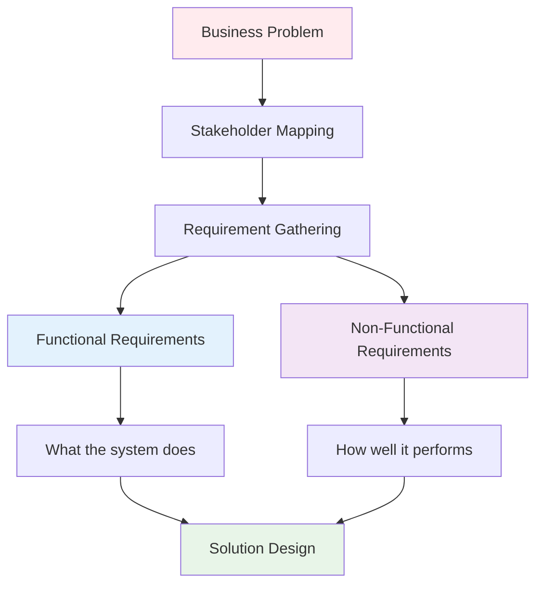

| Requirement Type | Focus | Example | Testable |
|-----------------|-------|---------|----------|
| **Functional** | Features & Behavior | "User can transfer money" | ✅ Yes |
| **Non-Functional** | Quality & Performance | "Transfer completes in <2 seconds" | ✅ Yes |
| **Business** | Outcomes & Value | "Reduce branch visits by 30%" | ✅ Yes |

### ✅ Best Practices
1. **Start with Business Context**: Always understand the "why" before the "what"
2. **Use Multiple Gathering Techniques**: Interviews, workshops, observation, prototypes
3. **Document Everything**: Create a central repository for all requirements
4. **Validate Early and Often**: Review with stakeholders regularly
5. **Trace Requirements**: Link each requirement back to a business objective
6. **Use Clear Language**: Avoid technical jargon when speaking with business users

### ⚠️ Common Challenges & Pitfalls

| Challenge | Why It Happens | Avoidance Strategy |
|-----------|----------------|-------------------|
| **Scope Creep** | Unclear boundaries | Define clear project scope document with sign-off |
| **Missing Stakeholders** | Incomplete identification | Use stakeholder mapping workshops |
| **Vague Requirements** | Lack of specificity | Use templates with specific fields (who, what, when, where) |
| **Gold Plating** | Adding unnecessary features | Focus on minimum viable product (MVP) first |
| **Changing Requirements** | Business environment shifts | Implement change control process |

---

## 📈 Card 2: KPI & Metric Definition

### 📖 Detailed Explanation
KPIs (Key Performance Indicators) and metrics are measurable values that demonstrate how effectively a business is achieving its key objectives. In software and data engineering, we need to define three types of metrics: Business KPIs (strategic outcomes), Operational metrics (process efficiency), and Data KPIs (data quality and performance). These metrics should be SMART (Specific, Measurable, Achievable, Relevant, Time-bound).

**Types of KPIs:**
- **Business KPIs**: Revenue, customer satisfaction, market share, conversion rates
- **Operational Metrics**: Process efficiency, error rates, throughput, resource utilization
- **Data KPIs**: Latency, freshness, accuracy, completeness, availability

### 🏢 Real-World Example
E-commerce platform launching a new recommendation engine:

**Business KPIs:**
- Increase average order value by 15% within 6 months
- Improve customer retention rate from 60% to 75%
- Boost conversion rate from 2.5% to 3.2%

**Operational Metrics:**
- Recommendation response time < 200ms
- System uptime > 99.9%
- Error rate < 0.1%

**Data KPIs:**
- Data freshness: Customer behavior data updated within 5 minutes
- Accuracy: Product catalog accuracy > 99.5%
- Latency: ML model inference time < 100ms

### 📊 Visual Representation

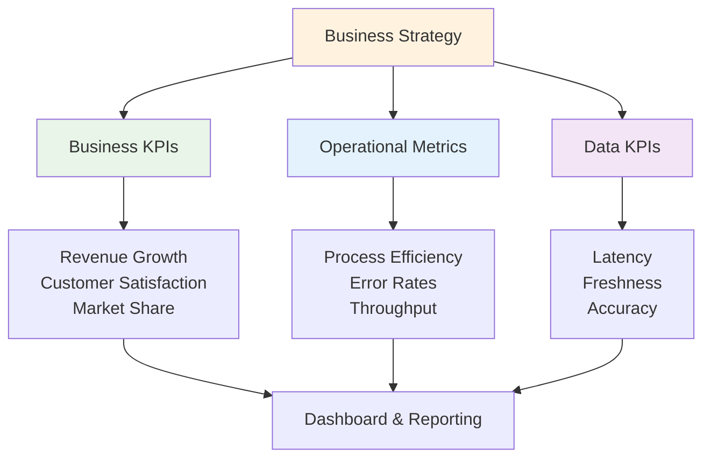

| Metric Type | Purpose | Frequency | Example Target |
|-------------|---------|-----------|----------------|
| **Business KPI** | Strategic success | Weekly/Monthly | Revenue +20% QoQ |
| **Operational** | Process efficiency | Daily/Real-time | Error rate <0.1% |
| **Data Quality** | Data reliability | Continuous | Accuracy >99% |

### ✅ Best Practices
1. **Align with Business Objectives**: Every metric should tie to a business goal
2. **Use the SMART Framework**: Make metrics Specific, Measurable, Achievable, Relevant, Time-bound
3. **Balance Leading and Lagging Indicators**: Track both predictive and outcome metrics
4. **Set Realistic Baselines**: Understand current state before setting targets
5. **Automate Measurement**: Use tools to automatically collect and report metrics
6. **Regular Review Cycles**: Schedule periodic reviews to assess and adjust targets

### ⚠️ Common Challenges & Pitfalls

| Challenge | Why It Happens | Avoidance Strategy |
|-----------|----------------|-------------------|
| **Too Many Metrics** | Trying to measure everything | Focus on 5-7 key metrics per project |
| **Vanity Metrics** | Measuring impressive but meaningless numbers | Ensure each metric drives decision-making |
| **Missing Baseline** | No current state measurement | Always establish baseline before project start |
| **Unrealistic Targets** | Overly ambitious goals | Use historical data and industry benchmarks |
| **Gaming the System** | People optimize for metrics, not outcomes | Choose metrics that align with true business value |

---

## 🎯 Card 3: Use Case Identification

### 📖 Detailed Explanation
Use case identification involves discovering and documenting all the different ways users will interact with the system to achieve business goals. In data engineering, this includes distinguishing between transactional use cases (operational day-to-day activities) and analytical use cases (reporting, insights, decision-making). It also involves understanding data flow patterns and choosing the right processing approach (real-time, near-real-time, or batch) based on business requirements.

**Key Concepts:**
- **Transactional Use Cases**: CRUD operations, business processes, real-time decisions
- **Analytical Use Cases**: Reporting, dashboards, ML models, business intelligence
- **Data Flow Mapping**: Understanding how data moves from source to consumption
- **Processing Trade-offs**: Balancing speed, cost, and complexity

### 🏢 Real-World Example
A streaming media company building a content recommendation platform:

**Transactional Use Cases:**
- User watches a video (real-time tracking)
- User rates content (immediate feedback)
- Content gets uploaded (metadata processing)

**Analytical Use Cases:**
- Generate personalized recommendations (near-real-time)
- Create executive dashboards (batch processing)
- A/B test content algorithms (batch analysis)

**Data Flow & Processing Choices:**
- **Real-time**: Fraud detection during payment (< 1 second)
- **Near-real-time**: Update recommendations (5-15 minutes)
- **Batch**: Daily content performance reports (overnight processing)

### 📊 Visual Representation

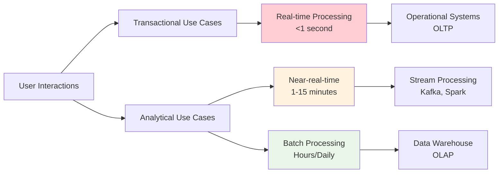

| Processing Type | Latency | Use Cases | Technology Examples |
|----------------|---------|-----------|-------------------|
| **Real-time** | <1 second | Fraud detection, Live chat | Stream processing, In-memory DBs |
| **Near-real-time** | 1-15 minutes | Personalization, Alerts | Kafka, Spark Streaming |
| **Batch** | Hours-Days | Reporting, ML training | ETL jobs, Data warehouses |

### ✅ Best Practices
1. **Start with Business Scenarios**: Identify what users need to accomplish
2. **Map User Journeys**: Document complete end-to-end workflows
3. **Categorize by Urgency**: Determine which use cases need immediate vs. delayed processing
4. **Consider Data Volume**: High-volume streams may need different architecture than low-volume
5. **Plan for Scalability**: Design for peak usage, not average
6. **Document Data Lineage**: Track how data flows through different use cases

### ⚠️ Common Challenges & Pitfalls

| Challenge | Why It Happens | Avoidance Strategy |
|-----------|----------------|-------------------|
| **Over-Engineering** | Building real-time systems for batch use cases | Match processing speed to business need |
| **Missing Edge Cases** | Focusing only on happy path scenarios | Consider error conditions and exceptions |
| **Unclear Priorities** | All use cases seem equally important | Use business value to prioritize |
| **Data Flow Complexity** | Not mapping dependencies between systems | Create comprehensive data flow diagrams |
| **Changing Requirements** | Business needs evolve during development | Build flexible, modular architectures |

---

## 🏗️ Card 4: Source System Analysis

### 📖 Detailed Explanation
Source system analysis involves understanding where your data comes from, how it's structured, and what constraints exist for extracting it. This includes distinguishing between OLTP systems (optimized for transactions) and OLAP systems (optimized for analytics), assessing technical feasibility of data extraction, and establishing Service Level Agreements (SLAs) with data providers. This analysis is crucial for designing realistic data pipelines and setting proper expectations.

**Key Components:**
- **OLTP (Online Transaction Processing)**: Operational databases, high volume transactions, normalized data
- **OLAP (Online Analytical Processing)**: Data warehouses, complex queries, denormalized data
- **Extraction Feasibility**: APIs, database connections, file transfers, real-time streams
- **SLA Considerations**: Uptime, refresh frequency, data quality guarantees

### 🏢 Real-World Example
A retail company building a customer analytics platform needs data from multiple sources:

**OLTP Sources:**
- E-commerce database (PostgreSQL): Customer orders, product catalog
- CRM system (Salesforce): Customer interactions, support tickets
- Inventory system (SAP): Stock levels, supplier data

**OLAP Sources:**
- Marketing data warehouse: Campaign performance, email metrics
- Financial system: Revenue, costs, profitability data

**Extraction Analysis:**
- E-commerce DB: REST API available, 1000 requests/hour limit
- Salesforce: Real-time streaming via Salesforce Streaming API
- SAP: Batch export files, updated nightly at 2 AM
- Marketing warehouse: Direct database connection during off-peak hours

### 📊 Visual Representation

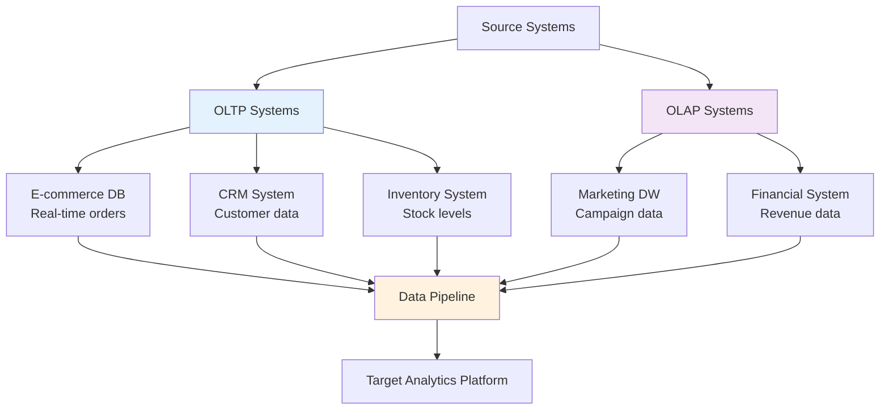

| System Type | Characteristics | Extraction Method | Typical SLA |
|-------------|----------------|-------------------|-------------|
| **OLTP** | High transaction volume, normalized | APIs, CDC, batch export | 99.9% uptime |
| **OLAP** | Complex queries, denormalized | Direct connection, file export | Nightly refresh |
| **SaaS** | External vendor system | REST APIs, webhooks | Vendor-dependent |
| **Legacy** | Older technology, limited APIs | File export, database replication | Limited availability |

### ✅ Best Practices
1. **Catalog All Data Sources**: Create comprehensive inventory of available systems
2. **Document Access Methods**: APIs, database connections, file formats, authentication
3. **Assess Data Quality**: Understand completeness, accuracy, and consistency at source
4. **Establish SLAs**: Define availability, refresh frequency, and support expectations
5. **Plan for Failure**: Design resilience for source system outages or data quality issues
6. **Security First**: Ensure proper authentication, encryption, and access controls

### ⚠️ Common Challenges & Pitfalls

| Challenge | Why It Happens | Avoidance Strategy |
|-----------|----------------|-------------------|
| **API Rate Limits** | Underestimating data volume needs | Test with production-scale data early |
| **Database Performance Impact** | Queries affecting source system performance | Use read replicas, schedule during off-peak |
| **Data Format Changes** | Source systems evolve without notice | Implement schema change detection |
| **Security Restrictions** | Limited access to production systems | Work with security teams early in planning |
| **Unrealistic SLAs** | Promising what source systems can't deliver | Validate capabilities before committing |

---

## 📄 Card 5: Defining Data Contracts

### 📖 Detailed Explanation
Data contracts are formal agreements that define expectations between data producers and consumers. They specify data structure (schema), quality requirements, delivery SLAs, and how changes will be handled. Think of them as APIs for data - they provide a stable interface that allows different teams to work independently while ensuring compatibility. Data contracts include schema definitions, data quality rules, backward compatibility requirements, and change management processes.

**Key Elements:**
- **Data Expectations**: Schema, data types, required fields, validation rules
- **Schema Evolution**: How structure changes are handled, versioning strategy
- **SLAs**: Availability, refresh frequency, latency requirements
- **Backward Compatibility**: Ensuring changes don't break existing consumers

### 🏢 Real-World Example
An e-commerce platform defining a contract for customer order data:

**Data Contract: Customer Orders v2.1**

```json
{
  "schema": {
    "order_id": "string (required, unique)",
    "customer_id": "integer (required)",
    "order_date": "timestamp (required, ISO 8601)",
    "total_amount": "decimal(10,2) (required, >0)",
    "status": "enum [pending, confirmed, shipped, delivered, cancelled]",
    "items": "array (required, min_length: 1)"
  },
  "quality_rules": {
    "completeness": ">99% for required fields",
    "timeliness": "Available within 5 minutes of order creation",
    "accuracy": "Amount calculations must match order total"
  },
  "sla": {
    "availability": "99.9% uptime",
    "latency": "<5 minutes from source",
    "refresh_frequency": "Real-time streaming"
  }
}
```

**Backward Compatibility Example:**
- Version 2.0 → 2.1: Added optional "delivery_notes" field (safe change)
- Version 1.x → 2.0: Changed "amount" from integer to decimal (breaking change, requires migration)

### 📊 Visual Representation

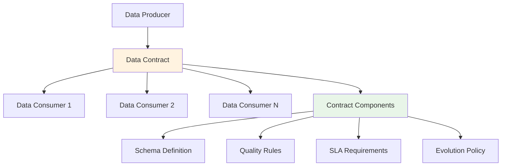

| Contract Element | Purpose | Example |
|-----------------|---------|---------|
| **Schema** | Data structure definition | Field names, types, constraints |
| **Quality Rules** | Data validation criteria | Completeness >99%, no nulls in key fields |
| **SLA** | Service level commitments | <5 min latency, 99.9% availability |
| **Evolution** | Change management policy | Backward compatible changes allowed |

### ✅ Best Practices
1. **Start Simple**: Begin with core fields and expand gradually
2. **Version Everything**: Use semantic versioning (major.minor.patch)
3. **Plan for Change**: Design schemas that can evolve without breaking consumers
4. **Document Thoroughly**: Include examples, validation rules, and business context
5. **Automate Validation**: Build automated testing for contract compliance
6. **Communicate Changes**: Establish clear processes for notifying consumers of changes

### ⚠️ Common Challenges & Pitfalls

| Challenge | Why It Happens | Avoidance Strategy |
|-----------|----------------|-------------------|
| **Breaking Changes** | Schema changes that break existing consumers | Use contract testing and gradual rollouts |
| **Ambiguous Contracts** | Unclear specifications lead to different interpretations | Provide concrete examples and test cases |
| **Contract Sprawl** | Too many versions and variations | Regular cleanup and consolidation |
| **Missing Validation** | Contracts not enforced in practice | Implement automated contract testing |
| **Poor Communication** | Changes not properly communicated | Establish change notification processes |

---

## 🔒 Card 6: Compliance & Governance Needs

### 📖 Detailed Explanation
Compliance and governance requirements ensure that data handling meets legal, regulatory, and organizational standards. Key regulations include GDPR (General Data Protection Regulation) for EU privacy, HIPAA (Health Insurance Portability and Accountability Act) for healthcare data, and various industry-specific requirements. This involves implementing proper data classification, handling Personally Identifiable Information (PII), establishing data retention policies, and ensuring audit trails for compliance reporting.

**Key Areas:**
- **GDPR**: Privacy rights, consent management, data minimization, right to be forgotten
- **HIPAA**: Protected Health Information (PHI) security, access controls, audit logs
- **PII Handling**: Data classification, encryption, anonymization techniques
- **Retention Policies**: Data lifecycle management, automated deletion, legal hold processes

### 🏢 Real-World Example
A healthcare analytics platform handling patient data:

**GDPR Requirements:**
- Obtain explicit consent for data processing
- Provide data portability (export patient data)
- Implement "right to be forgotten" (delete patient data on request)
- Maintain processing activity records

**HIPAA Requirements:**
- Encrypt PHI both at rest and in transit
- Implement role-based access controls
- Maintain audit logs of all data access
- Execute Business Associate Agreements (BAAs) with vendors

**PII Handling:**
- Classify data: PHI (highest protection), PII (medium), Public (lowest)
- Anonymize data for analytics: Remove direct identifiers, apply k-anonymity
- Implement data masking for development environments

**Retention Policies:**
- Patient records: 7 years after last treatment
- Audit logs: 3 years minimum
- Research data: Until study completion + 5 years
- Marketing data: Until consent withdrawal

### 📊 Visual Representation

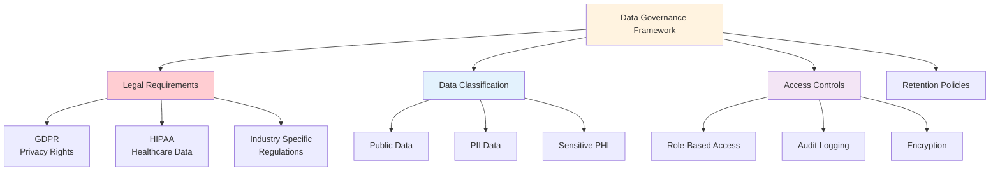

| Data Classification | Protection Level | Examples | Requirements |
|-------------------|------------------|----------|--------------|
| **Public** | Low | Marketing content, product info | Standard backup |
| **Internal** | Medium | Employee data, business metrics | Access controls, encryption |
| **PII** | High | Names, emails, addresses | Anonymization, consent tracking |
| **PHI/Sensitive** | Highest | Medical records, financial data | HIPAA/SOX compliance, audit logs |

### ✅ Best Practices
1. **Implement Privacy by Design**: Build privacy considerations into system architecture
2. **Automate Compliance**: Use tools to automatically apply retention policies and access controls
3. **Regular Audits**: Conduct periodic compliance assessments and gap analyses
4. **Training Programs**: Ensure all team members understand compliance requirements
5. **Documentation**: Maintain detailed records of data processing activities
6. **Vendor Management**: Ensure third-party providers meet compliance standards

### ⚠️ Common Challenges & Pitfalls

| Challenge | Why It Happens | Avoidance Strategy |
|-----------|----------------|-------------------|
| **Compliance Debt** | Requirements added after system design | Include compliance in initial requirements |
| **Data Silos** | Different systems with different protection levels | Implement centralized data governance |
| **Manual Processes** | Relying on humans for compliance tasks | Automate retention, deletion, and access management |
| **Scope Creep** | Expanding data usage beyond original consent | Implement purpose limitation and consent tracking |
| **Cross-Border Issues** | Data sovereignty and transfer restrictions | Understand data residency requirements early |

---

## ✅ Card 7: Stakeholder Review & Sign-off

### 📖 Detailed Explanation
Stakeholder review and sign-off processes ensure that all relevant parties understand, agree to, and formally approve the business requirements before development begins. This involves creating structured communication plans, establishing formal approval workflows, and implementing change management processes to handle requirement modifications. Effective sign-off processes prevent scope creep, reduce rework, and ensure accountability throughout the project lifecycle.

**Key Components:**
- **Communication Plans**: Regular updates, milestone reviews, escalation procedures
- **Sign-off Workflows**: Formal approval processes, documentation requirements, authority levels
- **Change Management**: Process for handling requirement changes after initial approval
- **Stakeholder Engagement**: Keeping all parties informed and involved at appropriate levels

### 🏢 Real-World Example
A financial services company implementing a new trading platform:

**Communication Plan:**
- **Weekly Status Updates**: Email summaries to all stakeholders
- **Bi-weekly Stakeholder Meetings**: Review progress, discuss issues, make decisions
- **Monthly Steering Committee**: Executive oversight, budget approval, strategic decisions
- **Quarterly Business Reviews**: Assess alignment with business strategy

**Sign-off Workflow:**
1. **Requirements Document Review** (5 business days)
   - Business Analyst prepares requirements
   - Technical Lead reviews feasibility
   - Compliance Officer reviews regulatory requirements

2. **Stakeholder Approval Process**
   - Department Heads: Functional requirements
   - IT Director: Technical feasibility and resources
   - Legal: Compliance and risk assessment
   - Finance: Budget approval
   - Executive Sponsor: Final sign-off

**Change Management Process:**
- **Minor Changes**: Business Analyst approval (< $10K impact)
- **Major Changes**: Steering Committee approval (> $10K impact)
- **Critical Changes**: Executive Sponsor approval (scope or timeline changes)

### 📊 Visual Representation

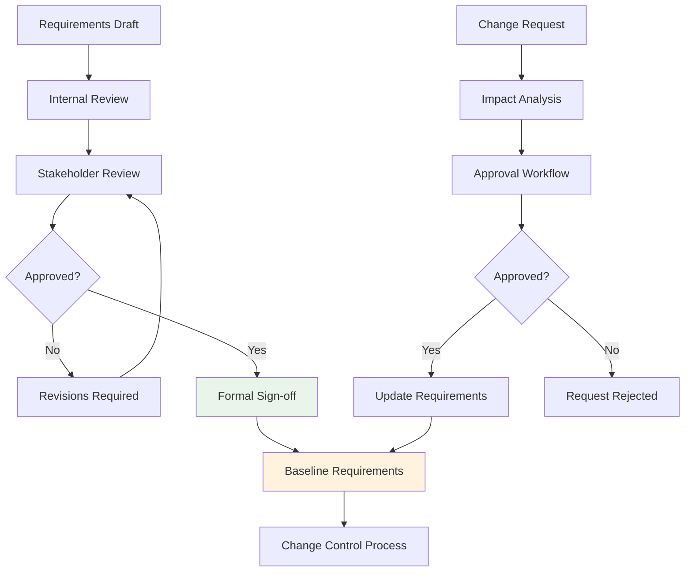

| Approval Level | Authority | Types of Decisions | Timeline |
|---------------|-----------|-------------------|----------|
| **Project Team** | Minor changes | Technical implementation details | 1-2 days |
| **Department Head** | Functional changes | Feature modifications | 3-5 days |
| **Steering Committee** | Major changes | Scope, budget, timeline changes | 1-2 weeks |
| **Executive Sponsor** | Strategic changes | Project direction, major investments | 2-4 weeks |

### ✅ Best Practices
1. **Clear Authority Matrix**: Define who can approve what types of decisions
2. **Structured Reviews**: Use templates and checklists for consistent evaluation
3. **Time-boxed Approvals**: Set deadlines to prevent decision paralysis
4. **Document Everything**: Maintain audit trail of all approvals and changes
5. **Regular Check-ins**: Schedule periodic reviews to catch issues early
6. **Escalation Paths**: Define clear processes for resolving disagreements

### ⚠️ Common Challenges & Pitfalls

| Challenge | Why It Happens | Avoidance Strategy |
|-----------|----------------|-------------------|
| **Analysis Paralysis** | Too many reviewers, unclear decision criteria | Limit reviewers, set clear approval criteria |
| **Rubber Stamp Approvals** | Stakeholders don't engage meaningfully | Require specific feedback, not just signatures |
| **Changing Requirements** | Business needs evolve during review | Implement formal change control process |
| **Missing Stakeholders** | Key decision makers not included | Complete stakeholder mapping upfront |
| **Delayed Approvals** | No urgency or accountability | Set deadlines with consequences for delays |

---

## 🎯 Card 8: Prioritization & Roadmapping

### 📖 Detailed Explanation
Prioritization and roadmapping help teams focus on the most valuable requirements first, especially when resources are limited. This involves using structured frameworks like MoSCoW (Must have, Should have, Could have, Won't have), the Kano Model (classifying features by customer satisfaction impact), and Value vs. Effort analysis to make informed decisions about what to build and when. Effective prioritization balances business value, technical feasibility, and strategic alignment.

**Key Frameworks:**
- **MoSCoW**: Categorizes requirements by necessity and impact
- **Kano Model**: Classifies features by customer satisfaction impact
- **Value vs. Effort**: Plots requirements on a matrix to identify quick wins
- **Weighted Scoring**: Uses multiple criteria to rank requirements objectively

### 🏢 Real-World Example
A SaaS company prioritizing features for their customer analytics platform:

**MoSCoW Analysis:**
- **Must Have**: User authentication, basic dashboard, data export
- **Should Have**: Advanced filtering, custom reports, email alerts
- **Could Have**: Machine learning insights, mobile app, API access
- **Won't Have**: Social media integration, video tutorials, white labeling

**Kano Model Classification:**
- **Basic (Expected)**: System security, data accuracy, reasonable performance
- **Performance (More is Better)**: Dashboard load speed, number of metrics
- **Excitement (Delighters)**: AI-powered recommendations, predictive analytics

**Value vs. Effort Matrix:**
- **High Value, Low Effort (Quick Wins)**: Email alerts, data export
- **High Value, High Effort (Major Projects)**: Machine learning insights
- **Low Value, Low Effort (Fill-ins)**: UI theme customization
- **Low Value, High Effort (Avoid)**: Complex social media integrations

### 📊 Visual Representation

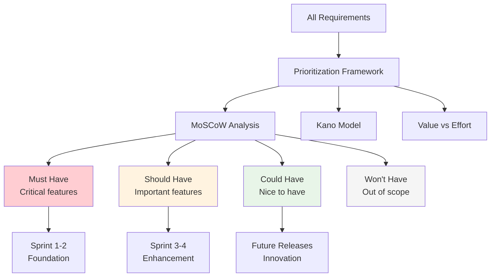

| Priority Level | Business Impact | Technical Effort | Timeline | Example |
|---------------|-----------------|------------------|----------|---------|
| **Must Have** | Critical | Any | Sprint 1-2 | User login, core functionality |
| **Should Have** | High | Medium | Sprint 3-4 | Advanced features, integrations |
| **Could Have** | Medium | Low-Medium | Future releases | Nice-to-have improvements |
| **Won't Have** | Low | Any | Not planned | Out of scope features |

### ✅ Best Practices
1. **Involve Business Stakeholders**: Ensure prioritization reflects business value, not just technical preferences
2. **Use Multiple Frameworks**: Combine different approaches for comprehensive analysis
3. **Consider Dependencies**: Account for technical and business dependencies between features
4. **Regular Reprioritization**: Review and adjust priorities based on changing business needs
5. **Transparent Criteria**: Make prioritization criteria visible to all stakeholders
6. **Minimum Viable Product (MVP)**: Focus on core value delivery first

### ⚠️ Common Challenges & Pitfalls

| Challenge | Why It Happens | Avoidance Strategy |
|-----------|----------------|-------------------|
| **Everything is High Priority** | Lack of clear business criteria | Use scoring frameworks with objective criteria |
| **Technical Bias** | Engineers prioritize technical debt over business value | Include business stakeholders in prioritization |
| **Changing Priorities** | Business strategy shifts during development | Regular priority reviews and change processes |
| **Feature Creep** | Adding "small" features that accumulate | Strict adherence to prioritization decisions |
| **Ignoring Dependencies** | Not considering technical or business relationships | Create dependency maps before prioritizing |

---

## 🎖️ Card 9: Business-Driven Data Quality Requirements

### 📖 Detailed Explanation
Business-driven data quality requirements define the standards that data must meet to effectively support business decisions and operations. Unlike technical data quality metrics, these requirements are defined from a business perspective and focus on how data quality impacts business outcomes. The key dimensions are accuracy (correctness), completeness (presence of required data), and consistency (uniformity across systems), each with specific business-relevant definitions and thresholds.

**Core Quality Dimensions:**
- **Accuracy**: Data correctly represents the real-world entities or events it describes
- **Completeness**: All required data elements are present and populated
- **Consistency**: Data values are uniform and standardized across different systems and time periods
- **Timeliness**: Data is available when needed for business processes and decisions

### 🏢 Real-World Example
An e-commerce company defining data quality requirements for their customer analytics:

**Accuracy Requirements:**
- Customer email addresses: 99.5% valid format and deliverable
- Product prices: 100% match with inventory system (zero tolerance for pricing errors)
- Order totals: Must equal sum of line items within $0.01

**Completeness Requirements:**
- Customer profiles: 95% must have email, shipping address, and phone number
- Product catalog: 100% of active products must have description, price, and category
- Transaction records: All orders must have customer ID, timestamp, and payment method

**Consistency Requirements:**
- Customer names: Standardized format across all systems (First Name, Last Name)
- Product categories: Use single taxonomy across website, mobile app, and reports
- Date formats: ISO 8601 standard (YYYY-MM-DD) across all systems

**Business Impact:**
- Poor email accuracy → 15% bounce rate costs $50K/month in lost marketing reach
- Incomplete customer profiles → 25% reduction in personalization effectiveness
- Inconsistent product categories → 40% increase in customer service inquiries

### 📊 Visual Representation

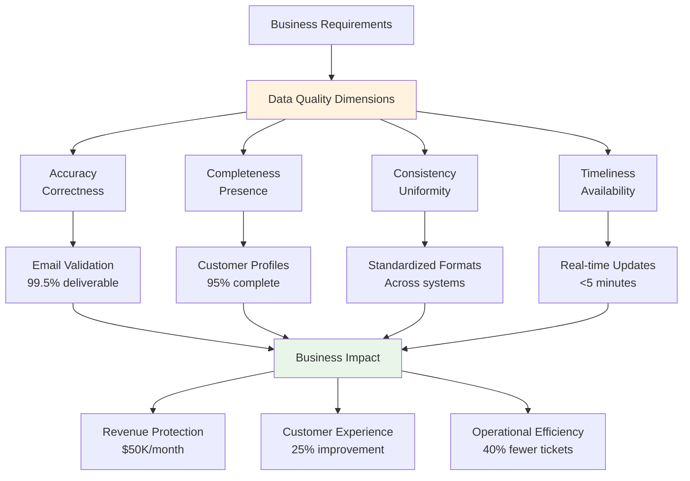

| Quality Dimension | Business Definition | Measurement Method | Acceptable Threshold |
|-------------------|-------------------|-------------------|-------------------|
| **Accuracy** | Data reflects reality | Validation rules, manual audits | 99%+ for critical fields |
| **Completeness** | Required fields populated | Null value monitoring | 95%+ for key attributes |
| **Consistency** | Uniform across systems | Cross-system comparison | 100% for reference data |
| **Timeliness** | Available when needed | Processing time monitoring | Meet SLA requirements |

### ✅ Best Practices
1. **Link to Business Outcomes**: Connect each quality requirement to specific business impact
2. **Set Realistic Thresholds**: Base targets on business needs, not technical perfection
3. **Automate Quality Monitoring**: Implement continuous monitoring and alerting
4. **Define Clear Ownership**: Assign responsibility for data quality to specific roles
5. **Regular Quality Reviews**: Schedule periodic assessments and improvement planning
6. **Root Cause Analysis**: When quality issues occur, fix the source, not just the symptom

### ⚠️ Common Challenges & Pitfalls

| Challenge | Why It Happens | Avoidance Strategy |
|-----------|----------------|-------------------|
| **Unrealistic Standards** | Setting 100% quality targets for all data | Align thresholds with business criticality |
| **Technical vs Business Focus** | Measuring technical metrics vs business impact | Define quality from user perspective |
| **Reactive Approach** | Only fixing quality issues after they cause problems | Implement proactive monitoring and prevention |
| **Lack of Ownership** | No clear accountability for data quality | Assign data stewards and quality champions |
| **One-Size-Fits-All** | Same quality standards for all data types | Customize requirements based on data usage |

---

## 💰 Card 10: Business Impact Mapping

### 📖 Detailed Explanation
Business impact mapping connects technical solutions to measurable business outcomes by analyzing Return on Investment (ROI), revenue impact, and customer experience improvements. This process helps justify project investments, prioritize features, and measure success. It involves quantifying both direct financial benefits (increased revenue, cost savings) and indirect benefits (improved customer satisfaction, competitive advantage) to create a comprehensive view of project value.

**Key Components:**
- **ROI Analysis**: Cost-benefit calculations, payback period, net present value
- **Revenue Impact**: Direct sales increases, cost reductions, efficiency gains
- **Customer Experience (CX) Link**: Satisfaction improvements, retention increases, loyalty building
- **Strategic Value**: Market positioning, competitive advantage, future opportunity enablement

### 🏢 Real-World Example
A retail bank implementing a real-time fraud detection system:

**ROI Analysis:**
- **Investment**: $2M development + $500K annual operations = $3M over 3 years
- **Benefits**: 
  - Fraud reduction: $5M/year in prevented losses
  - False positive reduction: $1M/year in operational savings
  - Customer satisfaction: $500K/year in retention value
- **ROI**: ($6.5M × 3 - $3M) / $3M = 550% ROI over 3 years

**Revenue Impact:**
- **Direct**: 
  - Prevent $5M/year in fraud losses
  - Reduce $200K/year in manual review costs
  - Avoid $300K/year in regulatory fines
- **Indirect**: 
  - 15% increase in customer trust scores
  - 25% faster transaction processing
  - 5% increase in digital channel adoption

**Customer Experience Impact:**
- **Quantifiable**: 
  - Reduce false declines from 5% to 1% (affects $10M transactions/month)
  - Decrease transaction processing time from 3 seconds to 0.5 seconds
  - Improve customer satisfaction score from 7.2 to 8.1 (10-point scale)

### 📊 Visual Representation

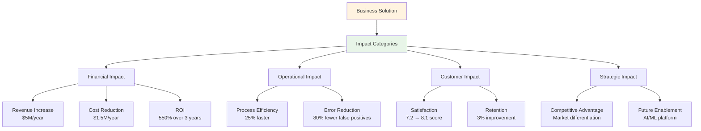

| Impact Category | Measurement Method | Timeline | Baseline | Target | Business Value |
|----------------|-------------------|----------|----------|--------|----------------|
| **Revenue** | Direct sales tracking | Monthly | $50M/month | $52.5M/month | +5% growth |
| **Cost Savings** | Operational expense reduction | Quarterly | $2M/quarter | $1.5M/quarter | -25% costs |
| **Customer Satisfaction** | NPS, CSAT surveys | Quarterly | 7.2/10 | 8.1/10 | +12.5% satisfaction |
| **Efficiency** | Process time measurement | Weekly | 3 seconds | 0.5 seconds | 83% improvement |

### ✅ Best Practices
1. **Use Multiple Metrics**: Combine financial, operational, and strategic measures
2. **Establish Baselines**: Measure current state before implementation
3. **Track Leading Indicators**: Monitor early signs of impact, not just final outcomes
4. **Regular Reviews**: Assess actual vs. projected benefits quarterly
5. **Attribution Modeling**: Clearly link improvements to specific solution features
6. **Long-term Perspective**: Consider both immediate and sustained value creation

### ⚠️ Common Challenges & Pitfalls

| Challenge | Why It Happens | Avoidance Strategy |
|-----------|----------------|-------------------|
| **Overstated Benefits** | Optimistic projections without data backing | Use conservative estimates and historical benchmarks |
| **Attribution Errors** | Claiming credit for improvements from other factors | Implement control groups and statistical analysis |
| **Short-term Focus** | Only measuring immediate impact | Track benefits over multiple years |
| **Ignoring Costs** | Underestimating total cost of ownership | Include all development, operational, and maintenance costs |
| **Unmeasured Benefits** | Focusing only on easily quantifiable impacts | Develop proxies for intangible benefits |

---

## 🤝 Card 11: Cross-Functional Alignment & Communication

### 📖 Detailed Explanation
Cross-functional alignment ensures that business stakeholders, engineering teams, and other departments work toward common goals with shared understanding. This involves translating technical concepts into business language, communicating technical debt and its business impact, and negotiating resources effectively across different functional areas. Success requires establishing common vocabulary, regular communication rhythms, and collaborative decision-making processes.

**Key Areas:**
- **Engineering-to-Business Translation**: Converting technical concepts into business impact terms
- **Technical Debt Communication**: Explaining how technical shortcuts affect business outcomes
- **Resource Negotiation**: Balancing competing priorities across departments
- **Shared Accountability**: Ensuring all teams understand their role in business outcomes

### 🏢 Real-World Example
A fintech company aligning engineering and business teams for a payment processing upgrade:

**Engineering-to-Business Translation:**
- **Technical**: "We need to refactor the payment service architecture to implement microservices"
- **Business**: "We need to restructure our payment system so we can launch new payment methods 3x faster and reduce system downtime from 4 hours to 30 minutes per month"

**Technical Debt Communication:**
- **Current State**: "Our monolithic architecture requires 6-week deployment cycles"
- **Business Impact**: "We're losing $200K/month because competitors launch features 4 weeks faster"
- **Solution**: "Investing $500K in architecture improvement will enable weekly deployments and $2M annual competitive advantage"

**Resource Negotiation:**
- **Business Request**: "We need the new payment feature in 6 weeks for Black Friday"
- **Engineering Reality**: "With current architecture, it takes 8 weeks minimum"
- **Negotiated Solution**: "We'll deliver a simplified version in 6 weeks, with full features 2 weeks later, requiring 2 additional engineers"

### 📊 Visual Representation

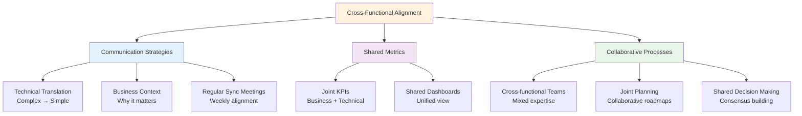

| Communication Type | Audience | Message Format | Frequency | Example |
|-------------------|----------|----------------|-----------|---------|
| **Technical Updates** | Business leaders | Impact-focused summaries | Weekly | "Payment latency improved 40%, reducing cart abandonment" |
| **Business Context** | Engineering team | User story with business rationale | Per feature | "Fast checkout reduces abandonment, worth $100K/month" |
| **Resource Requests** | Cross-functional | Cost-benefit analysis | As needed | "2 engineers for 3 months = $50K investment for $500K annual benefit" |
| **Progress Reports** | All stakeholders | Visual dashboards | Daily/Weekly | Traffic light status with key metrics |

### ✅ Best Practices
1. **Establish Common Language**: Create a glossary of terms that both business and technical teams understand
2. **Regular Cross-functional Meetings**: Schedule consistent alignment sessions with all key stakeholders
3. **Shared Metrics and Dashboards**: Use common KPIs that matter to both business and technical teams
4. **Embedded Team Members**: Place business analysts in engineering teams and technical liaisons with business units
5. **Joint Planning Sessions**: Include both business and technical perspectives in roadmap planning
6. **Transparent Trade-off Discussions**: Openly discuss technical constraints and business priorities

### ⚠️ Common Challenges & Pitfalls

| Challenge | Why It Happens | Avoidance Strategy |
|-----------|----------------|-------------------|
| **Jargon Barriers** | Each group uses specialized language | Create shared vocabulary and translation guides |
| **Competing Priorities** | Different departments have conflicting goals | Establish company-wide objectives and alignment |
| **Information Silos** | Teams don't share context and decisions | Implement cross-functional communication channels |
| **Blame Culture** | Teams point fingers when problems occur | Focus on collaborative problem-solving |
| **Misaligned Timelines** | Business and technical teams have different planning horizons | Synchronize planning cycles and expectations |

---

## 🏭 Card 12: Data Product Mindset

### 📖 Detailed Explanation
The data product mindset treats data as a product with internal customers, focusing on usability, reliability, and self-service capabilities rather than just technical data processing. This approach emphasizes understanding customer needs (internal data consumers), delivering value through well-designed data products, and enabling self-serve analytics so users can independently access and analyze data. It shifts from project-based thinking to product lifecycle management with continuous improvement.

**Core Principles:**
- **Data-as-a-Product**: Treating data like a product with customers, features, and lifecycle management
- **Internal Customer Focus**: Understanding and serving the needs of data consumers within the organization
- **Self-Service Enablement**: Building tools and interfaces that allow users to access data independently
- **Product Lifecycle Management**: Continuous development, maintenance, and improvement of data products

### 🏢 Real-World Example
A technology company transforming their analytics approach using data product principles:

**Traditional Approach (Project-based):**
- Marketing requests custom report → Data team builds one-off solution → Report delivered → No ongoing maintenance
- Result: 50+ custom reports, no consistency, high maintenance burden

**Data Product Approach:**
- **Product**: "Customer Analytics Hub" 
- **Customers**: Marketing, Sales, Product teams
- **Features**: 
  - Self-service dashboard builder
  - Pre-built template reports
  - Automated data refresh
  - Mobile-responsive interface

**Product Development Process:**
1. **Customer Discovery**: Interview marketing team to understand needs
2. **MVP Definition**: Core dashboard with 5 key metrics
3. **Iterative Development**: Add features based on user feedback
4. **Product Metrics**: Track usage, satisfaction, time-to-insight
5. **Continuous Improvement**: Monthly feature releases, quarterly strategy reviews

**Self-Service Capabilities:**
- **Data Catalog**: Searchable directory of available datasets with business definitions
- **Query Builder**: Visual interface for creating custom reports without SQL
- **Automated Insights**: AI-generated summaries of key trends and anomalies
- **Collaboration Tools**: Sharing, commenting, and annotation features

### 📊 Visual Representation

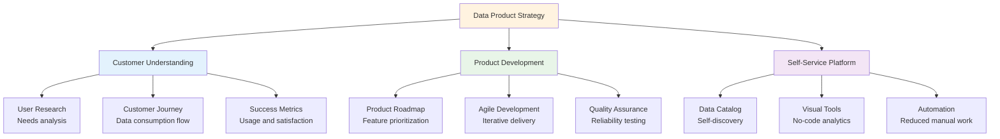

| Product Element | Traditional Approach | Data Product Approach | Business Impact |
|----------------|---------------------|----------------------|-----------------|
| **User Focus** | IT-driven requirements | Customer-driven features | Higher adoption rates |
| **Development** | One-time projects | Continuous improvement | Better user satisfaction |
| **Maintenance** | Reactive fixes | Proactive monitoring | Reduced downtime |
| **Scalability** | Manual processes | Self-service capabilities | Lower operational costs |

### ✅ Best Practices
1. **Start with Customer Needs**: Conduct user research to understand data consumption patterns
2. **Define Product Success Metrics**: Track usage, satisfaction, time-to-insight, and business impact
3. **Build for Self-Service**: Design intuitive interfaces that reduce dependency on technical teams
4. **Implement Product Lifecycle**: Treat data products like software products with roadmaps and releases
5. **Create Data Catalogs**: Make data discoverable with clear business definitions and lineage
6. **Invest in User Experience**: Prioritize ease of use over technical sophistication

### ⚠️ Common Challenges & Pitfalls

| Challenge | Why It Happens | Avoidance Strategy |
|-----------|----------------|-------------------|
| **Feature Creep** | Trying to satisfy every user request | Focus on core use cases and validate with multiple customers |
| **Technical Debt** | Prioritizing features over platform stability | Balance new features with technical improvements |
| **Low Adoption** | Building products without understanding user needs | Conduct regular user research and usability testing |
| **Governance Gaps** | Self-service without proper controls | Implement automated governance and quality controls |
| **Resource Competition** | Competing with operational priorities | Demonstrate clear ROI and business value |

---

## 🎯 Summary: Key Takeaways for Daily Practice

### Quick Reference Checklist
- [ ] **Requirements Gathering**: Focus on business outcomes, not just technical features
- [ ] **KPI Definition**: Ensure metrics drive decisions and align with business strategy
- [ ] **Use Case Identification**: Match processing approach (real-time/batch) to business needs
- [ ] **Source Analysis**: Understand system capabilities and limitations upfront
- [ ] **Data Contracts**: Define clear expectations and change management processes
- [ ] **Compliance**: Build governance into system design from the beginning
- [ ] **Stakeholder Management**: Establish clear communication and approval processes
- [ ] **Prioritization**: Use structured frameworks to focus on highest value work
- [ ] **Quality Requirements**: Link data quality to business impact and outcomes
- [ ] **Impact Mapping**: Quantify and track both financial and operational benefits
- [ ] **Cross-functional Alignment**: Translate between business and technical perspectives
- [ ] **Product Mindset**: Treat data as a product with customers and lifecycle management

### Common Success Patterns
1. **Start with Business Context**: Always understand the "why" before the "what"
2. **Validate Early and Often**: Use prototypes and feedback loops to reduce risk
3. **Focus on Value Delivery**: Prioritize features that deliver measurable business outcomes
4. **Plan for Change**: Build flexible architectures and processes that can evolve
5. **Invest in Communication**: Over-communicate rather than assume understanding
6. **Measure Everything**: Track progress, usage, and business impact continuously